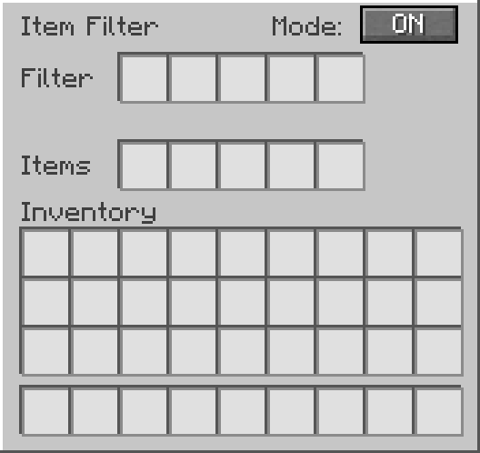
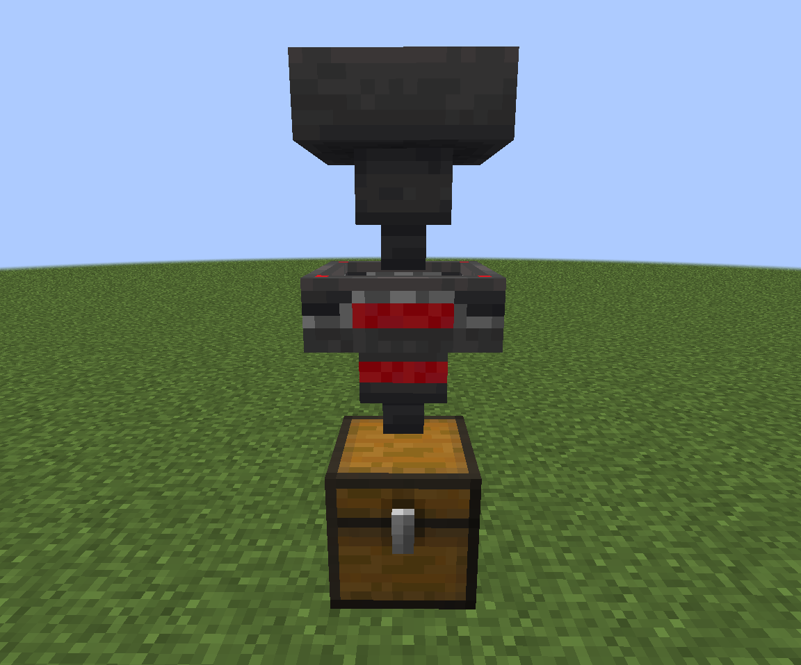
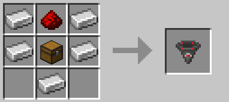

# Item Filter


A simple configurable item filter block for Minecraft Fabric.

## Download

<a href="https://modrinth.com/project/item-filter">
  
  Download on Modrinth
</a>

## Showcase

[](https://www.youtube.com/watch?v=oFVMrfMS_e0)

## Features

- Pulls From Above | Can pull items from inventories placed above, like chests, barrels, furnaces, smokers, and more.
- Hopper-like item transfer
- Configurable filter slots
- Toggleable filter mode
- Directional output like a vanilla hopper
- Custom GUI
- Works with chests, barrels, hoppers, and other inventories
- English and Brazilian Portuguese translations

## GUI



Inside the GUI:

- **Filter** slots define which items are allowed to pass
- **Items** slots work as the internal hopper inventory
- **Mode ON** allows only filtered items
- **Mode OFF** allows any item to pass through

## How It Works

Place the Item Filter like a hopper.

Items can enter from the top through hoppers or be pulled directly from inventories placed above the Item Filter.

Items leave through the direction the block is facing.

Example setup:



When filter mode is **ON**, only items matching the filter slots can enter the Item Filter.

When filter mode is **OFF**, the Item Filter works like a normal hopper and allows any item to pass through.

## Recipe



## Supported Version

- Minecraft: 1.21.1
- Mod Loader: Fabric
- Java: 21

## Requirements

- Fabric Loader
- Fabric API

## Installation

1. Install Fabric Loader for Minecraft 1.21.1.
2. Install Fabric API.
3. Put the Item Filter `.jar` file into your `mods` folder.
4. Launch the game.

## Development Setup

To build the mod, run:

```bash
./gradlew build
```

On Windows PowerShell:

```powershell
.\gradlew build
```

The compiled `.jar` will be generated in:

```text
build/libs/
```


## Author

Created by ThBTT.

## Contact

For questions, suggestions, or bug reports, join the Discord server:

https://discord.gg/pcKQSDgTzh

## License

This project is licensed under the MIT License.
